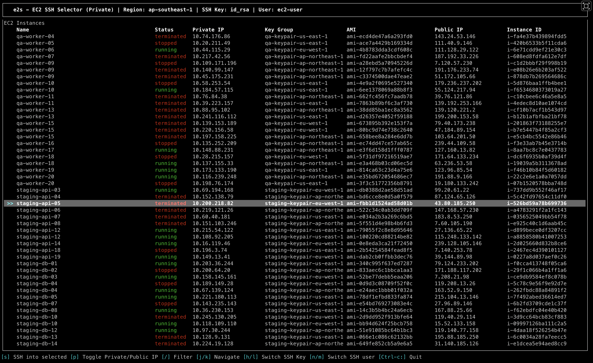

# 🚀 EC2 TUI

A blazingly fast Terminal User Interface (TUI) for managing AWS EC2 instances, built with Rust. Seamlessly list your EC2 instances and SSH into them with just a few keystrokes.

## ✨ Features

- 📋 **Interactive Instance List** - View all your EC2 instances in a beautiful TUI
- 🔐 **Quick SSH Access** - Connect to instances using your local SSH keys
- 👤 **Multi-User Support** - Configure multiple SSH users for different distributions
- ⚙️ **Configurable** - Easy TOML-based configuration
- ⚡ **Fast & Lightweight** - Built with Rust for optimal performance

## 📦 Installation
[Documentation](https://github.com/sandeshgrangdan/e2s/blob/main/USAGES.md)

## 🤝 Contributing

Contributions are welcome! Feel free to open issues or submit pull requests on [GitHub](https://github.com/sandeshgrangdan/e2s).

## 📝 License

This project is open source and available under the MIT License.

## 🐛 Issues & Support

If you encounter any issues or have questions, please [open an issue](https://github.com/sandeshgrangdan/e2s/issues) on GitHub.

---

Made with ❤️ and Rust
