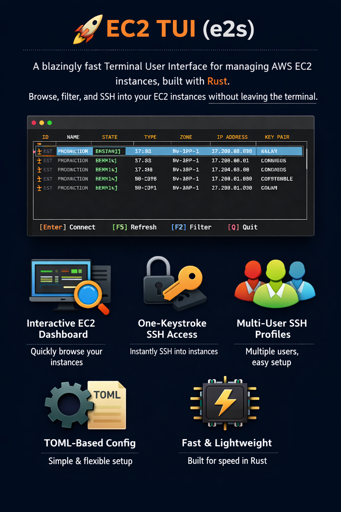

# e2s — EC2 SSH TUI Manager

A **blazingly fast Terminal User Interface (TUI)** for managing AWS EC2 instances, built with **Rust**.
Browse, filter, and SSH into your EC2 instances **without leaving the terminal**.

<!--  -->

  

---

## Features

* **Interactive EC2 Dashboard**
  Instantly list and navigate all your EC2 instances in a clean, responsive TUI.

* **One-Keystroke SSH Access**
  SSH into instances using your existing local SSH keys—no copy-pasting needed.

* **Multi-User SSH Profiles**
  Easily configure multiple SSH users (e.g. `ec2-user`, `ubuntu`, `admin`) for different AMIs.

* **TOML-Based Configuration**
  Simple, readable configuration with sensible defaults.

* **Fast & Lightweight**
  Written in Rust for high performance, low memory usage, and instant startup.

---

## Installation & Usage

Get **e2s** up and running in minutes and start connecting to your EC2 instances effortlessly.

**Guides**
- 👉 **[Installation & Usage Guide](https://github.com/sandeshgrangdan/e2s/blob/main/docs/USAGES.md)**  
  Learn how to install, run, and use `e2s` effectively.
- 👉 **[Configuration Guide](https://github.com/sandeshgrangdan/e2s/blob/main/docs/CONFIGURATION.md)**  
  Customize SSH users, keys, terminal preferences, and more.

> ⚠️ **Before you start:**  
> Ensure your **AWS credentials** and **SSH keys** are properly configured.

---

## How It Works

1. Fetches EC2 metadata using AWS SDK
2. Displays instances in an interactive TUI
3. Allows SSH access based on instance metadata and your config
4. Keeps everything inside your terminal—no browser needed

---

## Contributing

Contributions are **very welcome** 
Whether it’s a bug fix, feature request, or documentation improvement:

* Open an issue
* Submit a pull request
* Share ideas and feedback

👉 [GitHub Repository](https://github.com/sandeshgrangdan/e2s)

---

## Issues & Support

If you encounter bugs or have questions, please open an issue here:
👉 [Issues](https://github.com/sandeshgrangdan/e2s/issues)

---

## License

This project is licensed under the **MIT License**.
See the [LICENSE](./LICENSE) file for details.

---

## Acknowledgements

Built with:

* 🦀 **Rust**
* 🎨 Terminal UI libraries
* ☁️ AWS SDK

---

**Made with ❤️ and Rust by Sandesh**

